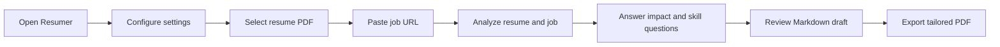

# Resumer

AI-Powered CLI/TUI Resume Tailor. Built with TypeScript, Node.js, and React (Ink).

## Installation

### Global Installation
Install the tool globally to use it anywhere on your system:
```bash
# Clone the repository
git clone git@github.com:name/resumer.git
cd resumer

# Build and install
npm run build
sudo npm install -g .
```

### Quick Setup & API Keys
To use this tool, you will need a few API keys. Here are the recommended affordable options:
- **LLM**: [DeepSeek API](https://platform.deepseek.com/) (Extremely affordable and high quality) or [OpenAI API](https://platform.openai.com/).
- **Scraper**: [Jina Reader API](https://jina.ai/reader/) (Free tier available, used to extract job descriptions).
- **Local Option**: [Ollama](https://ollama.com/) (Run LLMs locally for 100% privacy and zero cost).

### Development
```bash
npm run dev
```

## How to use

Simply run `resumer` (or `npm run dev`) to start the interactive wizard.



1. **Setup**: Go to `App Settings` to configure your LLM provider (DeepSeek, OpenAI, or Ollama), your LLM key or Ollama URL, and optionally your Jina Reader API key.
2. **Tailor Resume**: Select `Tailor Resume`, navigate to your `.pdf` file using the built-in file explorer, and provide the job offer URL.
3. **Analysis**: The app extracts the resume text, scrapes the job description, ranks recent roles to emphasize, and identifies weak or missing areas.
4. **Interview**: Answer short follow-up questions about role scope, ownership, impact, and any relevant missing skills. This gives the model evidence instead of guessing.
5. **Review**: The app generates a Markdown draft first, shows it in the TUI, and lets you approve it or request a revision before export.
6. **Result**: The approved resume is rendered to PDF and saved as `your-cv_tailored.pdf` in the same directory.

## Security & Privacy
- **Local Storage**: Your API keys are stored only on your local machine using the [`conf`](https://github.com/sindresorhus/conf) library. They are saved in your system's standard config directory (e.g., `~/.config/resumer-nodejs/`).
- **How it works**: The app initializes a local JSON file to persist your settings across sessions:
  ```typescript
  // src/config/index.ts
  export const config = new Conf<Config>({
    projectName: 'resumer',
    schema
  });
  ```
- **Direct Connection**: The app communicates directly from your machine to the AI providers (OpenAI, DeepSeek, or your local Ollama). There is no "middleman" server tracking your requests or keys.

## Tech Stack
- **Ink**: React-based Terminal UI.
- **Vercel AI SDK**: Unified interface for DeepSeek, OpenAI, and Ollama.
- **Jina Reader**: Markdown-based web scraping.
- **pdf-parse**: PDF text extraction.
- **md-to-pdf**: Professional PDF generation from Markdown.
